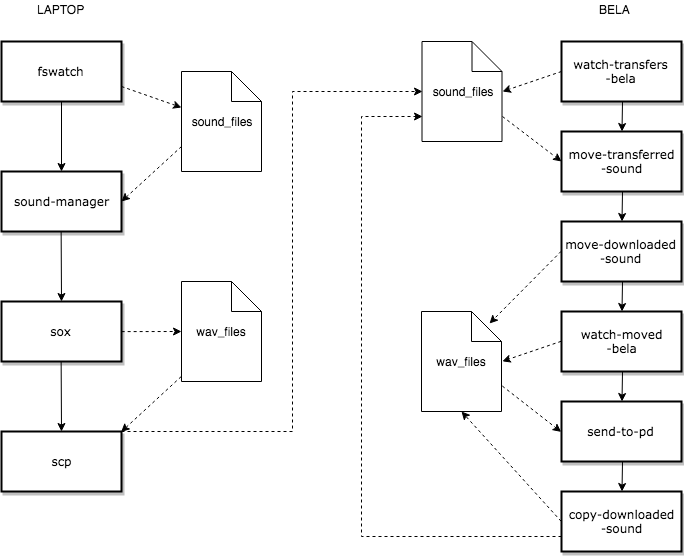

# Embedded AudioCommons

## Introduction

This code is part of the project "Embodied Interactions with E-Textiles and the Internet of Sounds for Performing Arts". The project proposes a prototyping system that allows performers to manipulate sounds through gestural interactions captured by textile wearable sensors. The e-textile sensor data control, in real-time, audio synthesis algorithms working with content from Audio Commons, a novel web-based ecosystem for repurposing crowd-sourced audio.

This part of the code aims at transferring downloaded audio files from the Internet in real time to the embedded [Bela platform](https://bela.io/). The workflow is: (1) downloading an audio file from a laptop/desktop computer connected to the Internet, (2) convert the file to a .wav file, (3) transfer it to the embedded platform Bela, and (4) send it to a Pure Data (Pd) patch. This code assumes that the laptop and the Bela platform are both connected to the same network, which has access to the Internet.

## Dependencies

- Bash scripts: fswatch, sox
- Python scripts: OS, subprocess, sys, time, logging, watchdog, threading

## Files



**fswatch-sounds-laptop.sh**: This shell script checks new files that are "created" in a directory (it assumes that the files are sound files) and launches the script `soundmanager.sh` passing the string with the filename and flag: `/Users/annaxambo/Downloads/sound_files/98166__reaktorplayer__rhythmic-1.wav Created`

**soundmanager.sh**: This shell script parses the incoming string from fswatch to get the filename and launches the `sox.sh` file passing the filename as an argument.

**sox.sh**: This shell script converts any incoming sound file (it is an assumption that a sound file is passed) to a wav stored as `wav_files/downloaded.wav`.

**scp.sh**: This script sends the wav file to Bela.

**watch-transfers-bela.py**: This python script watches for new files in the folder "sound_files" and when there is a new file, the python script "move-transferred-sound.py" is launched.

**move-transferred-sound.py**: This python script launches the shell script "move-downloaded-sound.sh" to copy the transferred file from "sound_files" to the folder "wav_files".

**move-downloaded-sound.sh**: # This shell script copies the transferred file from the folder  "sound_files" to the folder "wav_files".

**watch-moved-bela.py**: This python script watches for new files in the folder "wav_files" and when there is a new file, the python script "send-to-pd.py" is launched.

**send-to-pd.py**: # This script launches the shell script "copy-downloaded-sound.sh" to rename the file "downloaded.wav" to "current.wav" and then removes the original "downloaded.wav" from the "sound_files" folder.

**copy-downloaded-sound.sh**: This shell script renames the file "downloaded.wav" to "current.wav" from the "wav_files" folder and then removes the original "downloaded.wav" from the "sound_files" folder.


## Start

1. Get connected to the AudioCommons network.
2. Open one terminal and launch the script `fswatch.sh` from within the relevant directory:
```
./fswatch-sounds-laptop.sh
```
3. Open a second terminal, connect to Bela, and laund the following from within the relevant directory:
```
python watch-transfers-bela.py
python watch-moved-bela.py
```
4. Launch from the browser [Freesound](http://freesound.org). Download a sound.
5. As soon as a new sound has been downloaded, copy it to the folder `sound_files`, and the mechanism of conversion and file transferring will start.

## Publications

* Sophie Skach, Anna Xambó, Luca Turchet, Ariane Stolfi, Rebecca Stewart, Mathieu Barthet (2018). [Embodied Interactions with E-Textiles and the Internet of Sounds for Performing Arts](https://dl.acm.org/citation.cfm?doid=3173225.3173272), published in Proceedings of the Twelfth International Conference on Tangible, Embedded, and Embodied Interaction.

## Acknowledgments

The project Audio Commons is funded by the European Commission through the Horizon 2020 programme, research and innovation grant 688382. Thank you to all the authors of the paper to make this project possible: Sophie Skach, Luca Turchet, Ariane Stolfi, Rebecca Stewart, Mathieu Barthet. Special thanks to Luca Turchet and Giulio Moro for their assistance with the Bela platform.
